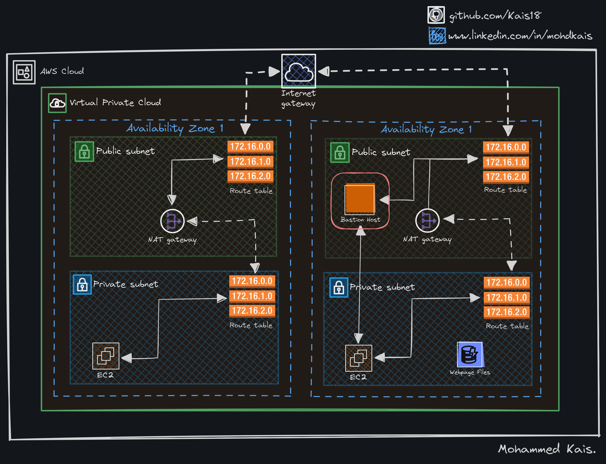
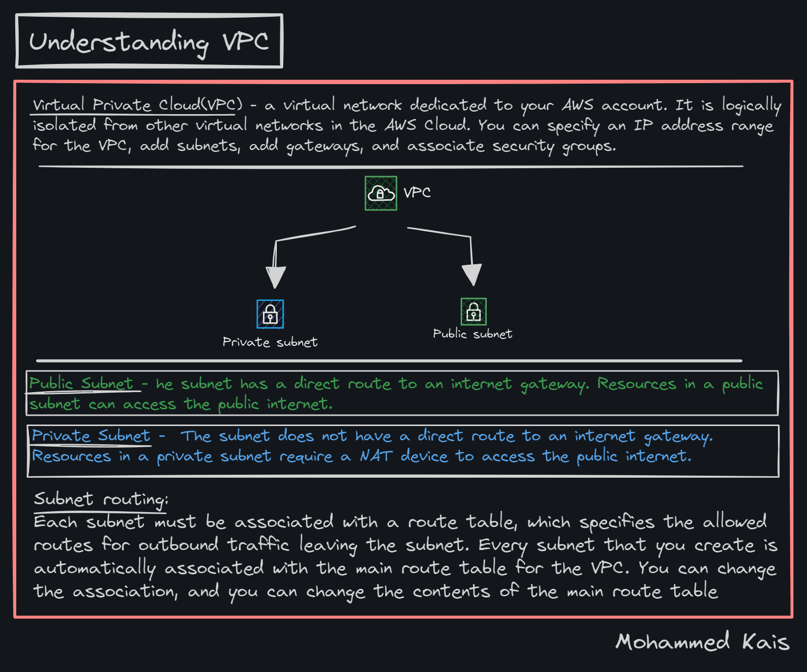

# Amazon Web Service VPC cheatsheet
 I have generated some handmade AWS Virtual Private Cloud cheat sheets, which can be printed.
 YOu can find [Handmade](#handmade) ones below with [Architecture](#architecture), [Understanding VPC](#understanding) and [Prerequites](#prerequisites)

 ## Handmake

 ### AWS

 #### Architecture

 

 #### Understanding VPC

#### Prerequisites

## Author
- Twitter: [@kaissssssss08](https://twitter.com/kaissssssss08)
- LinkedIn:[mohdkais](https://www.linkedin.com/in/mohdkais/)
- Portfoli:[kaiswork.shop](https://www.kaiswork.shop)
